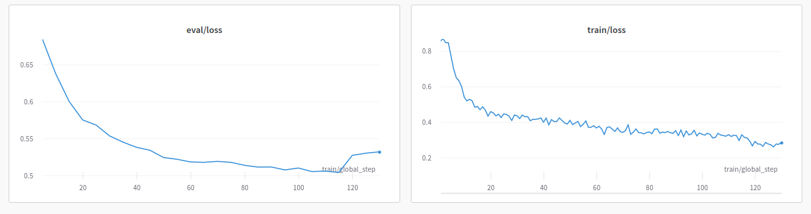

# Math Reasoning Finetuning

Finetuned Math reasoning model on combination of gsm8k and grade-school math dataset, as accumulated in [this link](https://huggingface.co/datasets/adi-kmt/math_data).

You can see the [config](qlora.yml) used to train the model, which uses a base mistral 7b model.

The model is uploaded for use on [huggingface](https://huggingface.co/adi-kmt/math-reasoning)

The eval and train loss can be seen below. 
