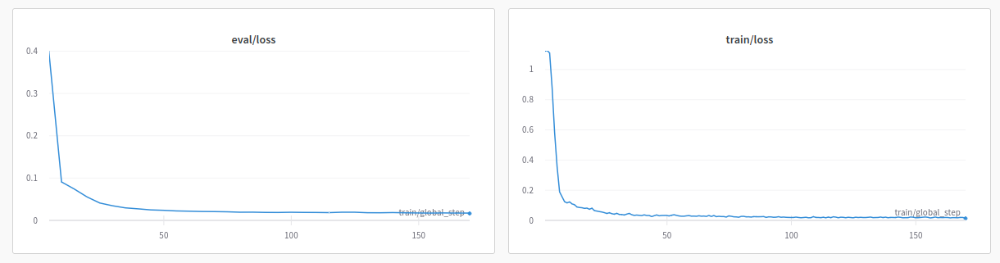

# SQL Coder

Finetuned an SQL coder model on SQL dataset [this link](https://huggingface.co/datasets/b-mc2/sql-create-context).

You can see the [config](qlora.yml) used to train the model, which uses a base zephyr 7b model.

The model is uploaded for use on [huggingface](https://huggingface.co/adi-kmt/sql-hermes)

The eval and train loss can be seen below. 
